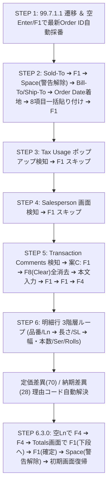

# QAD/MFG:PRO Automation & Modern Terminal Master Blueprint (v3)
**【AI引継ぎ用・システム統合設計書 ＆ 高速化・軽量化改修ガイドライン】**
**[Target Audience: AI Coding Assistants / Senior Software Engineers]**

> 2026-09-29整合性監査: 本文の「完全自動化」「絶対原則」は、現行コード・全実機ログの一致を保証しません。修正済み箇所と未解決条件は末尾7章および[整合性監査記録](docs/受注送信_整合性監査_2026-09-29.md)を参照してください。

---

## 1. システム全体概要 ＆ アーキテクチャ

本ドキュメントは、Python / CustomTkinter をベースとした社内基幹システム（QAD / MFG:PRO / Progress 4GL / VT100 CUI）の統合運用ツール群について、**「システム全体の設計思想」「各モジュールの役割」「将来のAIが安全に動作の軽量化・高速化を行うための着眼点」**、そして何よりも**「過去の膨大な実機検証から判明した『ここを変更すると破綻する』クリティカルな制約・地雷箇所（Invariants & Pitfalls）」**を網羅した完全引き継ぎ設計書です。

### 1.1 主要コンポーネント構成
本システムは以下の4つのサブシステムが協調して動作しています。

```
┌─────────────────────────────────────────────────────────────────────────────┐
│                       自作モダンターミナル.pyw (メインUI)                   │
│  - CustomTkinter によるモダンGUI (ダークテーマ / Chrome風タブ)              │
│  - マルチタブ SSH セッション管理 (Paramiko)                                 │
│  - 自動画面検知: レポート自動Excel展開 (※保守画面は厳格除外)                │
└──────────────────────┬──────────────────────────────┬───────────────────────┘
                       │                              │
        ┌──────────────┴──────────────┐┌──────────────┴──────────────┐
        │       order_entry.py        ││      terminal_core.py       │
        │ - 注文入力サイドバー(F3/Ctrl)││ - VT100 仮想画面バッファ    │
        │ - オートコンプリート (JSON) ││   (Pyte 80x24 / 132x24)     │
        │ - 99.7.1.1 自動化エンジン   ││ - 入力フィールド/カーソル追跡│
        │   (SalesOrderAutomation)    ││ - VT100 キーシーケンス変換   │
        └──────────────┬──────────────┘└──────────────────────────────┘
                       │
┌──────────────────────┴──────────────────────────────────────────────────────┐
│                    QAD サーバー (Progress 4GL CUI / VT100)                  │
│  - 99.7.1.1 (xxsosomt.p): 受注登録・保守 (Step 1 〜 Step 6.3.0 完全自動入力)│
│  - 99.3.6.1 / 99.7.6.20 等: 32prn gzip圧縮ストリーム高速抽出 ＆ GAS送信     │
└─────────────────────────────────────────────────────────────────────────────┘
```

### 1.2 ファイル構成と役割一覧

| ファイルパス | 役割・概要 | 同期先 (Desktop) |
| :--- | :--- | :--- |
| `自作モダンターミナル.pyw` | メインGUIアプリ。SSH接続、マルチタブ、キーバインド、自動化UI直結。 | `Desktop/自作モダンターミナル.pyw` |
| `order_entry.py` | 受注入力サイドバー、F3デバッグ出力、99.7.1.1完全自動入力コントローラ。 | `Desktop/order_entry.py` |
| `terminal_core.py` | VT100 画面バッファ（Pyte）、カーソル位置追跡、文字属性、キーマッピング。 | `Desktop/terminal_core.py` |
| `itemList.json` | 品目マスターデータ（サイドバーのオートコンプリート用キャッシュ）。 | - |
| `terminal_config.json` | 接続設定、ポート、配色テーマ、フォント設定。 | - |
| `docs/QAD_99_7_1_1_Order_Entry_Manual.md` | エンドユーザー・運用者向けの最新業務操作マニュアル (Markdown)。 | `Desktop/QAD_99_7_1_1_Order_Entry_Manual.md` |
| `docs/QAD_99_7_1_1_Order_Entry_Manual.pdf` | 高解像度ベクターSVGフロー図を埋め込んだ配布用PDFマニュアル。 | `Desktop/QAD_99_7_1_1_Order_Entry_Manual.pdf` |
| `scratch/generate_pdf_with_svg.py` | Edge ヘッドレス（`--print-to-pdf`）を用いた高品質PDF自動生成スクリプト。 | - |
| `tests/test_order_entry.py` | サイドバーUI、バリデーション、リセット機能等の単体テスト。 | - |
| `tests/test_step6_order_automation.py` | 99.7.1.1 自動入力コントローラ（Step 1〜6.3.0）の包括的モックテスト。 | - |

---

## 2. 【最重要・変更厳禁】触ると壊れる「地雷・クリティカル制約」集 (Pitfalls & Invariants)

> [!CAUTION]
> **以下の項目は、過去の実機検証（Progress 4GL特有の挙動や端末エミュレーション不整合）において、試行錯誤の末に解決された絶対制約です。**
> **「コードを短く見せるため」「一般的なUNIXターミナルの常識」に基づいて安易に変更すると、文字抜け、無限ループ、データ破損、二重発注などの致命的な障害を引き起こします。絶対に以下の原則を崩さないでください。**

### 2.1 【絶対原則 1】ブラインド送信（Typeahead / 先走り送信）の絶対禁止
- **事象**: `shell.send("value\r")` を `time.sleep(0.1)` などの固定待機だけで連続送信すると、Progress 4GL 側の画面再描画やDBトランザクション処理が追いつかず、キー入力が脱字したり、次画面の不要な項目へ文字が誤爆入力されます。
- **解決策**:
  - すべての画面遷移・ポップアップ展開・確定において、**必ず仮想画面バッファ（`terminal_core.py` の `get_text()` / `get_screen_lines()`）を監視し、目的の文字列（正規表現）またはカーソル位置が検知されるまで待機する「スマートウェイト（同期待ち受け）」**を徹底すること。
  - ポーリング待機には必ず `max_wait`（タイムアウト: 通常 2〜5 秒）を設け、万が一のタイムアウト時は勝手に次のキーを送らず、直ちに安全停止してエラーを通知すること。

### 2.2 【絶対原則 2】改行コードは `\r` (CR) のみ使用（`\n` や `\r\n` は厳禁）
- **事象**: UNIX系だからと `\n`（LF）を送ると、Progress 4GL の CUI では Enter（決定）と認識されず無視されるか、あるいは文字コードエラーとなります。また `\r\n` を送ると「決定＋空エンター（2回押し）」として処理され、次の入力フィールドを勝手に空文字で飛ばしてしまいます。
- **解決策**:
  - Enter キー（決定 / 次フィールド遷移）は、**例外なく `\r` (キャリッジリターン / `0x0D`)** を送信してください。

### 2.3 【絶対原則 3】「Press space bar to continue」にはスペース `" "` のみ送信
- **事象**: カテゴリ警告や与信限度警告等で表示される `'Press space bar to continue.'` に対し、`" \r"` や `"\r"` を送信すると、解除後の次画面（メインメニューや次フィールド）に余計な Enter が持ち越され、`** Invalid Choice **` エラーや意図しないデフォルト確定が発生します。
- **解決策**:
  - このプロンプトを検知した際は、**スペースキー `" "`（半角スペース1文字、改行なし）のみを送信** してください。

### 2.4 【絶対原則 4】ファンクションキー ＆ 端末シーケンスの固有定義
QAD（Progress 4GL）のキーマッピングは、社内環境の `protermcap`（端末定義ファイル）に厳格に縛られています。一般的な xterm や vt100 の定義とは一部異なります。

| キー名称 | 送信シーケンス | 用途・留意事項 |
| :--- | :--- | :--- |
| **`<F1>` (Go / 実行)** | `\x1bOP` | フィールド確定、次ステップ実行、ポップアップスキップ。 |
| **`<F4>` (End / 終了)** | `\x1bOS` | 入力終了、ポップアップ脱出、注文正式コミット。 |
| **`<F8>` (Clear / 全消去)** | `\x1b[19~` | Step 5 特記事項エディタでの既定コメント全行消去（案C）。 |
| **`Back-Tab` (左列移動)** | `\x15` (`Ctrl-U` / `^u`) | **【罠】`\x1b[Z` は一切効きません。** QAD 端末では `\x15` が左列（前カラム）移動です。 |
| **`Clear / Ctrl+Z`** | `\x1a` (`Ctrl-Z`) | エディタ画面での行クリア補完。 |
| **`Delete / Ctrl+D`** | `\x04` / `\x1b[3~` | ターミナル側で Ctrl+D を押した際は Delete キー（文字削除）として中継。 |

### 2.5 【絶対原則 5】Order ID（受注番号）の自動採番と一連管理（二重採番の絶対禁止）
- **事象**: テスト時や自動化時に、Order 欄に安易に Enter を連打すると、QAD サーバー側で `SO199392`, `SO199394`, `SO199395`... と空の受注データが次々と無駄に永久採番されてしまいます。また、他人が作成した既存 Order ID のデータを勝手に書き換えると基幹システムに重大な障害を与えます。
- **解決策**:
  - **1回の注文登録処理において、自動採番（空Enter）を行うのは Step 1 の最初の1回のみ** です。
  - 採番された Order ID（例: `SO199401`）をログおよび状態変数に記録し、全明細行・特記事項・最終コミットまでをこの単一の ID 配下で完遂してください。

### 2.6 【絶対原則 6】文字コード（CP932 / Shift_JIS）とバイト幅スライス
- **事象**: QAD 端末は `cp932` で動作しています。半角カナ（例: `ﾀｶﾗ`）や全角漢字が混在する場合、Python の文字列文字数 `len(text)` と端末表示上の桁数（半角1桁・全角2桁）が乖離します。
- **解決策**:
  - 文字列のスライスやカラム判定を行う際は、必ず `text.encode('cp932')` でバイト列にしてからスライス幅を計算し、`decode('cp932', errors='replace')` で戻してください。これを怠るとカラム位置がズレてパースが全壊します。

### 2.7 【絶対原則 7】保守画面（`*mt.p`）とレポート自動Excel展開の完全分離
- **事象**: モダンターミナルには「罫線（`│─── ───│`）で囲まれたレポート表を検知すると自動でExcelを起動して貼り付ける」超便利機能が備わっています。しかし、99.7.1.1（`xxsosomt.p`）などの保守画面（Maintenance）の明細罫線をレポートと誤認すると、注文入力中に勝手にExcelが次々と起動して入力フォーカスを奪ってしまいます。
- **解決策**:
  - 画面最上行に `*mt.p` や `Maintenance`、`Sales Order` が含まれる画面は、レポート自動展開ロジックから厳格に除外（ガード）されています。この除外判定を解除してはなりません。

### 2.8 【絶対原則 8】GUIメインスレッドのブロッキング禁止
- **事象**: SSH 通信やスマートウェイトの監視ループ（`while` ループ + `time.sleep`）を CustomTkinter の GUI メインスレッド内で直接実行すると、ウィンドウ全体が「応答なし（フリーズ）」になり、画面描画やキー入力、中断操作が一切効かなくなります。
- **解決策**:
  - 自動入力マクロは必ず `threading.Thread(target=..., daemon=True)` でバックグラウンド実行してください。
  - バックグラウンドスレッドから GUI の状態（ステータスラベル、ダイアログ等）を変更する際は、必ず `master.after(0, callback)` を使用してメインスレッドにディスパッチしてください。

---

## 3. QAD 99.7.1.1 受注入力 完全自動化プロトコル仕様

各ステップの同期待ち受け条件、送信シーケンス、フェイルセーフの完全仕様です。



### 詳細ステップ仕様表

| ステップ | 画面名 / 状態 | 待機文字列・検知条件 (正規表現) | 送信キー・データ | 留意事項・フェイルセーフ |
| :--- | :--- | :--- | :--- | :--- |
| **Step 1** | Order番号採番 | `r"order:"` を検知 | `\r` (空Enter) または `<F1>` | 空のままEnter/F1でサーバーがOrder ID（例: `SO199401`）を自動採番。 |
| **Step 2** | ヘッダー項目入力 | カーソルが Sold-To (Row 3, Col 29) または `r"sold-to:"` | `Sold-To + \r` ➔ `<F1>` ➔ (警告時 `" "`) ➔ `Bill-To + \r` ➔ `Ship-To + \r` ➔ Order Date着地待機 ➔ Order Dateから8項目改行結合一括送信 ➔ `<F1>` | 実機仕様: Sold-To 入力後に F1 送信でマスタ検証を実行し、警告プロンプト (Category=... 等) が出た場合は Space 送信で解除して住所枠を展開・Bill-To 欄をアクティブ化。Bill-To/Ship-To 確定後、Order Date 着地を待ってから全8項目（OrderDate, ReqDate, Promise, DueDate, Perform, PricingDate, PO, Remarks）を一括送信。送信後に `<F1>` で確定。 |
| **Step 3** | 税金設定 | `r"tax usage:"` または `r"tax environment:"` | `\x1bOP` (`<F1>`) | ポップアップを無変更でスキップ。 |
| **Step 4** | 営業担当者 | `r"salesperson 1:"` または `r"freight list:"` | `\x1bOP` (`<F1>`) | 無変更でスキップ。 |
| **Step 5** | 特記事項 (案C) | `r"transaction comments"` | **有**: `\x1bOP` ➔ `\x1b[19~` (`<F8>`) ➔ 本文行 + `\r` ➔ `\x1bOP` ➔ `\x1bOP` ➔ `\x1bOS` (`<F4>`)<br>**無**: `\x1bOS` (`<F4>`) | `<F8>` (Clear) で得意先マスタ引用の既定13行等を一括消去。確認プロンプト時は `y\r`。Quoteポップアップ確定後に `<F4>` で明細へ。 |
| **Step 6.1.0** | 明細行番号採番 | `r"sales order line"` ＆ 空の `Ln` 欄 | `\r` (Enter) | 行番号（1, 2, ...）が自動採番。 |
| **Step 6.1.1** | Create WO | `r"create wo:"` | `\x1bOP` (`<F1>`) | スキップ。 |
| **Step 6.1.3** | 品番 ＆ Site | `r"item number"` 欄アクティブ | 品番 (`product_name`) + `\x1bOP` ➔ Site待機 ➔ `CB2` + `\x1bOP` | Site ポップアップ出現を確実に待機してから "CB2" を送信。 |
| **Step 6.1.4** | Qty スキップ | `r"qty ordered um"` | `\x1bOP` (`<F1>`) | 平米数は後工程から自動計算されるためスキップ。 |
| **Step 6.1.4-SL** | サブライン採番 | `r"item width\(mm\):"` ＆ `r"sl"` | `\x1bOP` (`<F1>`) | サブライン（SL 1, SL 2...）を採番。 |
| **Step 6.2.0** | 長さ入力 | `r"len\(m\)"` 欄アクティブ | 長さ (`length`) + `\x1bOP` | 長さ（m）を入力して確定。 |
| **Step 6.2.1** | ロール明細 | `r"ser t rolls width"` ポップアップ | `\x1bOP` (Serスキップ) ➔ 本数 (`quantity`) + `\r` ➔ 幅 (`width`) + `\r` | 同一長さのロールを繰り返し入力。完了行で `<F4>` (`\x1bOS`) ➔ `Please confirm update` に `\x1bOP` (`yes`)。 |
| **Step 6.1.4 完** | 全スリット完了 | SL一覧画面 | `\x1bOS` (`<F4>`) ➔ `Please confirm update` に `\r` (`yes`) | 全スリット確定。 |
| **Step 6.2.3** | Pricing Date | `r"pricing date:"` | `\x1bOP` (`<F1>`) | スキップ。 |
| **Step 6.2.4** | 単価入力 | `r"list price"` / `r"price"` | `\x1bOP` (List Priceスキップ) ➔ 単価 (`price`) + `\x1bOP` | 単価を入力して確定。 |
| **Step 6.2.5** | 税・コメント | `r"tax usage:"` ➔ `r"transaction comments"` | Tax: `\x1bOP` ➔ Comments: `\x1bOS` (`<F4>`) | 明細コメントは不要なため `<F4>` でスキップ。 |
| **Step 6.2.5-Rsn** | 理由コード解決 | `r"reason code"` または `r"rsn"` | 定価差異: `70\r` / 納期差異: `28\r` ➔ `\x1bOP` | 定価や納期がマスターと異なる場合の必須対応。 |
| **Step 6.3.0** | 最終コミット | `r"line total:"` / `r"total tax:"` | `\x1bOP` (`<F1>` 下段へ) ➔ `\x1bOP` (`<F1>` 確定) ➔ `" "` (Space 警告解除) ➔ 初期画面復帰 | 実機検証仕様: Totals画面の0.00%で `<F1>` を2回押し（下段移動➔確定）、Spaceで与信警告を解除して受注完了。 |

---

### 3.1 実機検証で得られたトラブルシューティング教訓・同期仕様（重要）

1. **Step 2: Sold-To 送信直後の遅延と警告（Category=）検知ポーリング**:
   - `Sold-To` に顧客コードを入力して Enter を送信すると、サーバー側で得意先マスタ検索と住所展開が走り、最下段に `Category=... Press space bar to continue.` が表示されるまでに約0.6〜1.0秒のラグが生じます。
   - 単なる短時間スリープ（0.4秒等）で判定すると警告が出現する前に通過してしまい、後続キーが詰まる原因になります。
   - **対策**: 最大2.5秒間（100ms周期）画面をポーリング監視し、警告が出現した瞬間に `<Space>` を送信して解除する同期ロジックを徹底しています。
2. **Step 2: Order Date からの8項目一括貼り付けへの分離**:
   - `Sold-To`, `Bill-To`, `Ship-To` の3項目はサーバー側の住所展開・検証を待つため順次送信（各ステップ間に0.5〜0.6秒のウェイトを確保）。
   - 下段の `Order Date` にカーソルが着地したことを確認してから、Order Date 〜 Remarks までの全8項目（Pricing Date 空スキップ含む）を一括貼り付け送信することで、入力バッファの混信（`Bill To` に `test` 等が誤入力される問題）を完全に防止します。
3. **Step 6: 複数製品（Line 2+）の Create WO 重複 Enter 防止**:
   - 1品目目の Reason Code 確定（F1）直後、QADサーバー側で自動的に Line 2 が採番され、画面にはすでに `Create WO: Y Rework: Y Exact: Y` が表示されています。
   - ここで不要な Enter を送るとフォーカスがずれてしまうため、画面に `create wo:` が既に出現している場合は Enter をスキップし直ちに `<F1>` を送ります。
4. **Step 6.3.0: 最終合計画面（Totals）の F1×2回 + Space 確定フロー**:
   - 画面が `0.00%`（Totals 画面）に到達した時点で、`<F1>`（下段へ） ➔ `<F1>`（確定） ➔ `<Space>`（与信警告解除） を送信して正式コミットします。
   - メインメニュー（`mfmenu`）へ復帰すると画面上の Order ID 文字列が消去されるため、Totals 画面到達時点で `self.order_id` を確定抽出して保持・返却します。

---

## 4. 32prn レポート高速抽出 ＆ GAS送信アーキテクチャ

レポート取得（在庫 99.3.6.1、Complaint 99.3.21.4、受注残 99.7.6.20、売上 99.7.5.11）における設計仕様です。

### 4.1 32prn gzip直接受信方式のメリット
- **完全ファイルレス**: サーバー上に一時ファイル（`winPrint`）を作成・削除しないため、ディスク容量圧迫やファイル衝突リスクが完全にゼロ。
- **高速転送**: サーバー側で `gzip -9` 圧縮されて送信されるため、約4MBのレポートが約234KBに圧縮され、SSHストリーム経由で数秒で受信・解凍完了。

### 4.2 並行取得 ＆ GAS送信ルーター
- `ThreadPoolExecutor(max_workers=2)` により、複数レポートを独立した SSH セッションで完全並行抽出。
- 抽出完了したものから順に、ブラウザ（Chrome/Edge）の非表示フォームを経由して GAS へ非同期 POST 送信（SSO/社内認証を自然にクリアし、3秒後にタブ自動クローズ）。

---

## 5. 次のAIによる「動作の軽量化・高速化」レビュー・改良ポイント

今後別のAIが本システムをレビューし、さらなる**パフォーマンス改善・軽量化・高速化**を実施する際の推奨着眼点とガイドラインです。

### 5.1 【高速化 1】画面同期待ち受け（Wait-for）のポーリング間隔最適化
- **現状**: `wait_for_condition` 等で `time.sleep(0.05)` 〜 `time.sleep(0.1)` のスリープを挟んでポーリングしています。
- **改良余地**:
  - `pyte` の画面バッファが更新された瞬間（`Stream` の更新フックやイベント通知）に `threading.Event` を `set()` して待ち受けを即座に起床させる「イベント駆動型待機」へ進化させると、固定ポーリングの無駄な待機時間（合計で数秒〜十数秒）をほぼゼロ（数十ミリ秒以内）に短縮できます。

### 5.2 【高速化 2】正規表現コンパイルと画面スキャン範囲の限定
- **現状**: ループ内で毎回 `re.search(pattern, screen_text, re.IGNORECASE)` を実行している箇所があります。
- **改良余地**:
  - 判定用正規表現をクラス定数・モジュール定数として事前に `re.compile()` しておく。
  - 画面全体（80×24行）ではなく、ステータス行（最下行 Row 23〜24）やヘッダー部（Row 1〜3）など、プロンプトが出現する行範囲に限定してスキャンすることで、CPU負荷を削減できます。

### 5.3 【軽量化 3】Tkinter 描画処理の間引き（スロットリング）
- **現状**: 大量データ受信時やストリーム受信時に、1パケット受信ごとに `textbox` へのタグ適用・テキスト挿入を行っています。
- **改良余地**:
  - 描画更新を 30fps〜60fps（約 16ms〜33ms 間隔）でスロットリング（間引き）し、未描画分をバッファリングしてまとめて反映（`after_idle`）することで、UIメインスレッドの描画負荷を大幅に軽減できます。

### 5.4 【堅牢化 4】単体テスト駆動によるリファクタリング
- **ルール**:
  - 改修を行う際は、必ず既存の単体テスト（`tests/test_order_entry.py`, `tests/test_step6_order_automation.py`）を実行し、全34件以上のテストが全てパスすることを確認しながら進めてください。
  - 新たな高速化ロジックを追加した場合は、対応するモックテストを作成して品質を担保してください。

---

## 6. 開発・テスト・同期運用ルール

1. **言語・品質方針**:
   - 回答、解説、コード内コメントはすべて**日本語**。
   - 時間の早さよりも「正確性」「品質」「既存機能のデグレ厳禁」を最優先。
2. **プロジェクト配置・編集運用の原則**:
   - 本システムの正本パスは `C:\Users\0138018\.antigravity\mfgpro_controller\` です。
   - デスクトップ等への不要なコピー・同期は行わず、常に本フォルダ内のファイルを直接編集・テスト・Git管理してください。
3. **実機検証の絶対規律（複数Order ID採番の永久禁止）**:
   - **【最重要命令】実機検証時に何度も新規ログイン・空Enter/F1を行って新たなOrder IDを複数取得することは絶対に厳禁（永久禁止）** です。サーバーDBの採番整合性を破壊するため、新規採番テストの乱発は固く禁止します。
   - 実機検証が必要な場合は、**必ず1つの既存Order ID（すでに採番された単一のオーダー）を開き、そのオーダーの中で `<F1>` / `<F4>` を用いて画面間を移動しながら動作を検証してください**。
   - 基本的なロジック検証やリグレッションテストは、実機を汚さない **モック単体テスト（`tests/test_*.py`）** を最大限活用して完結させてください。

## 7. 2026-09-29 事前表示と実送信の整合性監査

詳細と根拠は[受注送信の整合性監査](docs/受注送信_整合性監査_2026-09-29.md)に記載。

追加テストと実機で必要な確認は[受注送信の検証手順](docs/受注送信_検証手順.md)を参照。オフライン57件中51件成功・受入条件6件失敗を確認済み。失敗を隠さず、`scripts/verify_order.py --acceptance`で再現する。

- **修正済み**: 送信先sessionと画面判定元を一致させ、タブ切替やGUI描画遅延の影響を除いた。payloadは開始時にコピーし、遅延エラー通知が例外変数消失で失敗する問題を修正した。
- **表示と実装の共有**: ヘッダー8項目の生成処理と合計画面の確定キーを共有した。F3は登録結果の事前検証ではなく、現在の送信予定を示す説明である。
- **未解決**: `scratch/order_test6_execution.log` のF1→F4→F4と、現行コードのF1→F1→Spaceが一致しない。今回、送信キー順序は変更していない。
- **未解決**: 常駐ラベルだけの画面判定、固定待機、一括送信、警告の誤通過・重複応答、部分入力後の再送、顧客コード・制御文字・文字コード検証、登録値の読み戻し不足。
- **対象外**: 同一製品への異なる単価はシステム上入力不可であることをユーザーに確認済み。単価に関する入力・集約仕様は変更しない。
- 保存済み実機ログとオフライン試験は区別する。今回、VPN接続・受注採番・実サーバーの注文更新は行っていない。
