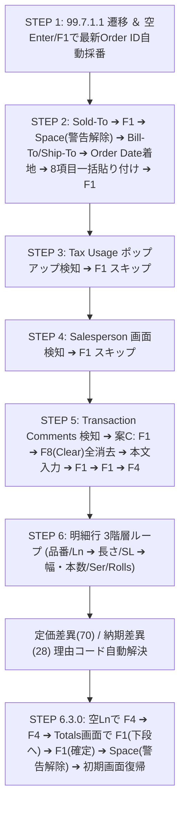

# QAD/MFG:PRO Automation & Modern Terminal Master Blueprint (v3)
**【AI引継ぎ用・システム統合設計書 ＆ 高速化・軽量化改修ガイドライン】**
**[Target Audience: AI Coding Assistants / Senior Software Engineers]**

> 2026-09-29整合性監査: 本文の「完全自動化」「絶対原則」は、現行コード・全実機ログの一致を保証しません。修正済み箇所と未解決条件は末尾7章および[整合性監査記録](docs/受注送信_整合性監査_2026-09-29.md)を参照してください。

---

## 1. システム全体概要 ＆ アーキテクチャ

本ドキュメントは、Python / CustomTkinter をベースとした社内基幹システム（QAD / MFG:PRO / Progress 4GL / VT100 CUI）の統合運用ツール群について、**「システム全体の設計思想」「各モジュールの役割」「将来のAIが安全に動作の軽量化・高速化を行うための着眼点」**、そして何よりも**「過去の膨大な実機検証から判明した『ここを変更すると破綻する』クリティカルな制約・地雷箇所（Invariants & Pitfalls）」**を網羅した完全引き継ぎ設計書です。

### 1.1 主要コンポーネント構成
本システムは以下の4つのサブシステムが協調して動作しています。

```
┌─────────────────────────────────────────────────────────────────────────────┐
│                       自作モダンターミナル.pyw (メインUI)                   │
│  - CustomTkinter によるモダンGUI (ダークテーマ / Chrome風タブ)              │
│  - マルチタブ SSH セッション管理 (Paramiko)                                 │
│  - 自動画面検知: レポート自動Excel展開 (※保守画面は厳格除外)                │
└──────────────────────┬──────────────────────────────┬───────────────────────┘
                       │                              │
        ┌──────────────┴──────────────┐┌──────────────┴──────────────┐
        │       order_entry.py        ││      terminal_core.py       │
        │ - 注文入力サイドバー(F3/Ctrl)││ - VT100 仮想画面バッファ    │
        │ - オートコンプリート (JSON) ││   (Pyte 80x24 / 132x24)     │
        │ - 99.7.1.1 自動化エンジン   ││ - 入力フィールド/カーソル追跡│
        │   (SalesOrderAutomation)    ││ - VT100 キーシーケンス変換   │
        └──────────────┬──────────────┘└──────────────────────────────┘
                       │
┌──────────────────────┴──────────────────────────────────────────────────────┐
│                    QAD サーバー (Progress 4GL CUI / VT100)                  │
│  - 99.7.1.1 (xxsosomt.p): 受注登録・保守 (Step 1 〜 Step 6.3.0 完全自動入力)│
│  - 99.3.6.1 / 99.7.6.20 等: 32prn gzip圧縮ストリーム高速抽出 ＆ GAS送信     │
└─────────────────────────────────────────────────────────────────────────────┘
```

### 1.2 ファイル構成と役割一覧

| ファイルパス | 役割・概要 | 同期先 (Desktop) |
| :--- | :--- | :--- |
| `自作モダンターミナル.pyw` | メインGUIアプリ。SSH接続、マルチタブ、キーバインド、自動化UI直結。 | `Desktop/自作モダンターミナル.pyw` |
| `order_entry.py` | 受注入力サイドバー、F3デバッグ出力、99.7.1.1完全自動入力コントローラ。 | `Desktop/order_entry.py` |
| `terminal_core.py` | VT100 画面バッファ（Pyte）、カーソル位置追跡、文字属性、キーマッピング。 | `Desktop/terminal_core.py` |
| `itemList.json` | 品目マスターデータ（サイドバーのオートコンプリート用キャッシュ）。 | - |
| `terminal_config.json` | 接続設定、ポート、配色テーマ、フォント設定。 | - |
| `docs/QAD_99_7_1_1_Order_Entry_Manual.md` | エンドユーザー・運用者向けの最新業務操作マニュアル (Markdown)。 | `Desktop/QAD_99_7_1_1_Order_Entry_Manual.md` |
| `docs/QAD_99_7_1_1_Order_Entry_Manual.pdf` | 高解像度ベクターSVGフロー図を埋め込んだ配布用PDFマニュアル。 | `Desktop/QAD_99_7_1_1_Order_Entry_Manual.pdf` |
| `scratch/generate_pdf_with_svg.py` | Edge ヘッドレス（`--print-to-pdf`）を用いた高品質PDF自動生成スクリプト。 | - |
| `tests/test_order_entry.py` | サイドバーUI、バリデーション、リセット機能等の単体テスト。 | - |
| `tests/test_step6_order_automation.py` | 99.7.1.1 自動入力コントローラ（Step 1〜6.3.0）の包括的モックテスト。 | - |

---

## 2. 【最重要・変更厳禁】触ると壊れる「地雷・クリティカル制約」集 (Pitfalls & Invariants)

> [!CAUTION]
> **以下の項目は、過去の実機検証（Progress 4GL特有の挙動や端末エミュレーション不整合）において、試行錯誤の末に解決された絶対制約です。**
> **「コードを短く見せるため」「一般的なUNIXターミナルの常識」に基づいて安易に変更すると、文字抜け、無限ループ、データ破損、二重発注などの致命的な障害を引き起こします。絶対に以下の原則を崩さないでください。**

### 2.1 【絶対原則 1】ブラインド送信（Typeahead / 先走り送信）の絶対禁止
- **事象**: `shell.send("value\r")` を `time.sleep(0.1)` などの固定待機だけで連続送信すると、Progress 4GL 側の画面再描画やDBトランザクション処理が追いつかず、キー入力が脱字したり、次画面の不要な項目へ文字が誤爆入力されます。
- **解決策**:
  - すべての画面遷移・ポップアップ展開・確定において、**必ず仮想画面バッファ（`terminal_core.py` の `get_text()` / `get_screen_lines()`）を監視し、目的の文字列（正規表現）またはカーソル位置が検知されるまで待機する「スマートウェイト（同期待ち受け）」**を徹底すること。
  - ポーリング待機には必ず `max_wait`（タイムアウト: 通常 2〜5 秒）を設け、万が一のタイムアウト時は勝手に次のキーを送らず、直ちに安全停止してエラーを通知すること。

### 2.2 【絶対原則 2】改行コードは `\r` (CR) のみ使用（`\n` や `\r\n` は厳禁）
- **事象**: UNIX系だからと `\n`（LF）を送ると、Progress 4GL の CUI では Enter（決定）と認識されず無視されるか、あるいは文字コードエラーとなります。また `\r\n` を送ると「決定＋空エンター（2回押し）」として処理され、次の入力フィールドを勝手に空文字で飛ばしてしまいます。
- **解決策**:
  - Enter キー（決定 / 次フィールド遷移）は、**例外なく `\r` (キャリッジリターン / `0x0D`)** を送信してください。

### 2.3 【絶対原則 3】「Press space bar to continue」にはスペース `" "` のみ送信
- **事象**: カテゴリ警告や与信限度警告等で表示される `'Press space bar to continue.'` に対し、`" \r"` や `"\r"` を送信すると、解除後の次画面（メインメニューや次フィールド）に余計な Enter が持ち越され、`** Invalid Choice **` エラーや意図しないデフォルト確定が発生します。
- **解決策**:
  - このプロンプトを検知した際は、**スペースキー `" "`（半角スペース1文字、改行なし）のみを送信** してください。

### 2.4 【絶対原則 4】ファンクションキー ＆ 端末シーケンスの固有定義
QAD（Progress 4GL）のキーマッピングは、社内環境の `protermcap`（端末定義ファイル）に厳格に縛られています。一般的な xterm や vt100 の定義とは一部異なります。

| キー名称 | 送信シーケンス | 用途・留意事項 |
| :--- | :--- | :--- |
| **`<F1>` (Go / 実行)** | `\x1bOP` | フィールド確定、次ステップ実行、ポップアップスキップ。 |
| **`<F4>` (End / 終了)** | `\x1bOS` | 入力終了、ポップアップ脱出、注文正式コミット。 |
| **`<F8>` (Clear / 全消去)** | `\x1b[19` | Step 5 特記事項エディタでの既定コメント全行消去（案C）。<br>**【重要】末尾チルダ `~` は厳禁**。`protermcap` では `CLEAR(F8)=\E[19:` のため、`\x1b[19~` を送ると先頭に `~` が誤入力されます。 |
| **`Back-Tab` (左列移動)** | `\x15` (`Ctrl-U` / `^u`) | **【罠】`\x1b[Z` は一切効きません。** QAD 端末では `\x15` が左列（前カラム）移動です。 |
| **`Clear / Ctrl+Z`** | `\x1a` (`Ctrl-Z`) | エディタ画面での行クリア補完。 |
| **`Delete / Ctrl+D`** | `\x04` / `\x1b[3~` | ターミナル側で Ctrl+D を押した際は Delete キー（文字削除）として中継。 |

### 2.5 【絶対原則 5】Order ID（受注番号）の自動採番と一連管理（二重採番の絶対禁止）
- **事象**: テスト時や自動化時に、Order 欄に安易に Enter を連打すると、QAD サーバー側で `SO199392`, `SO199394`, `SO199395`... と空の受注データが次々と無駄に永久採番されてしまいます。また、他人が作成した既存 Order ID のデータを勝手に書き換えると基幹システムに重大な障害を与えます。
- **解決策**:
  - **1回の注文登録処理において、自動採番（空Enter）を行うのは Step 1 の最初の1回のみ** です。
  - 採番された Order ID（例: `SO199401`）をログおよび状態変数に記録し、全明細行・特記事項・最終コミットまでをこの単一の ID 配下で完遂してください。

### 2.6 【絶対原則 6】文字コード（CP932 / Shift_JIS）とバイト幅スライス
- **事象**: QAD 端末は `cp932` で動作しています。半角カナ（例: `ﾀｶﾗ`）や全角漢字が混在する場合、Python の文字列文字数 `len(text)` と端末表示上の桁数（半角1桁・全角2桁）が乖離します。
- **解決策**:
  - 文字列のスライスやカラム判定を行う際は、必ず `text.encode('cp932')` でバイト列にしてからスライス幅を計算し、`decode('cp932', errors='replace')` で戻してください。これを怠るとカラム位置がズレてパースが全壊します。

### 2.7 【絶対原則 7】保守画面（`*mt.p`）とレポート自動Excel展開の完全分離
- **事象**: モダンターミナルには「罫線（`│─── ───│`）で囲まれたレポート表を検知すると自動でExcelを起動して貼り付ける」超便利機能が備わっています。しかし、99.7.1.1（`xxsosomt.p`）などの保守画面（Maintenance）の明細罫線をレポートと誤認すると、注文入力中に勝手にExcelが次々と起動して入力フォーカスを奪ってしまいます。
- **解決策**:
  - 画面最上行に `*mt.p` や `Maintenance`、`Sales Order` が含まれる画面は、レポート自動展開ロジックから厳格に除外（ガード）されています。この除外判定を解除してはなりません。

### 2.8 【絶対原則 8】GUIメインスレッドのブロッキング禁止
- **事象**: SSH 通信やスマートウェイトの監視ループ（`while` ループ + `time.sleep`）を CustomTkinter の GUI メインスレッド内で直接実行すると、ウィンドウ全体が「応答なし（フリーズ）」になり、画面描画やキー入力、中断操作が一切効かなくなります。
- **解決策**:
  - 自動入力マクロは必ず `threading.Thread(target=..., daemon=True)` でバックグラウンド実行してください。
  - バックグラウンドスレッドから GUI の状態（ステータスラベル、ダイアログ等）を変更する際は、必ず `master.after(0, callback)` を使用してメインスレッドにディスパッチしてください。

### 2.9 【絶対原則 9】SSHターミナルにおけるカーソル座標判定（VT100 DSR / `get_cursor_pos()`）の過信・乱用禁止
- **事象**:
  - 画面遷移や入力可能状態の判定に `self.get_cursor_pos()`（カーソルのX座標/Y座標）を用いると、実機のSSH接続下ではエスケープシーケンス（`\x1b[6n`）に対するサーバーからの応答がネットワーク遅延や画面描画パケットと混ざり、カーソル座標の取得に失敗・タイムアウトするか、誤判定を引き起こします。
  - 実際に Step 6（Ln / Item Number 欄）でカーソル列判定（`cx >= 5`）を条件に組み込んだ際、ローカルモックテストは通過するものの実機ターミナルでは同期が取れず停止・誤送信が頻発しました。
- **解決策**:
  - **SSH経由での画面同期・待機判定は、カーソル座標に依存せず、仮想画面バッファの「画面文字列・正規表現ベース（`lambda txt: ...`）」で行うことを絶対原則とします。**

### 2.10 【絶対原則 10】大画面・フレーム遷移（特に Step 5 ➔ Step 6）におけるウェイト短縮の禁止
- **事象**:
  - キー入力を全体的に高速化しようとして、各ステップ間の `sleep` を極限まで削ると、QAD（Progress 4GL）の画面モード切替（特に特記事項エディタ画面から明細一覧画面への `<F4>` 抜け）の再描画処理が追いつかなくなります。
  - 画面が完全に Sales Order Line へ切り替わる前に Step 6 の `6.1.0 Ln 自動採番` の Enter キーが送信されて空振りし、その直後に送信された品番（例: `BW0100D`）がまだフォーカスの残る Ln 欄へ流れ込んで `│100` などと誤入力され、システムが停止します。
- **解決策**:
  - **画面全体やフレームが大きく切り替わるキー送信直後（Step 2 ヘッダー確定 F1、Step 5 コメント完了 F4、Step 6.3.0 最終合計画面への F4 等）の `sleep` は、最低でも `0.4〜0.5秒` を死守してください。**
  - 単に入力スピードを上げるのではなく、「同画面内の連続入力」は速く、「画面・モードが切り替わる瞬間」は十分な待機時間を確保するメリハリが必須です。

---

## 3. QAD 99.7.1.1 受注入力 完全自動化プロトコル仕様

各ステップの同期待ち受け条件、送信シーケンス、フェイルセーフの完全仕様です。



### 詳細ステップ仕様表

| ステップ | 画面名 / 状態 | 待機文字列・検知条件 (正規表現) | 送信キー・データ | 留意事項・フェイルセーフ |
| :--- | :--- | :--- | :--- | :--- |
| **Step 1** | Order番号採番 | `r"order:"` を検知 | `\r` (空Enter) または `<F1>` | 空のままEnter/F1でサーバーがOrder ID（例: `SO199401`）を自動採番。 |
| **Step 2** | ヘッダー項目入力 | カーソルが Sold-To (Row 3, Col 29) または `r"sold-to:"` | `Sold-To + \r` ➔ `<F1>` ➔ (警告時 `" "`) ➔ `Bill-To + \r` ➔ `Ship-To + \r` ➔ Order Date着地待機 ➔ Order Dateから8項目改行結合一括送信 ➔ `<F1>` | 実機仕様: Sold-To 入力後に F1 送信でマスタ検証を実行し、警告プロンプト (Category=... 等) が出た場合は Space 送信で解除して住所枠を展開・Bill-To 欄をアクティブ化。Bill-To/Ship-To 確定後、ハイブリッド判定（納品先反映＋下段Order Date着地）を待ってから全8項目を一括送信。送信後に `<F1>` で確定。 |
| **Step 3** | 税金設定 | `r"tax usage:"` または `r"tax environment:"` | `\x1bOP` (`<F1>`) | ポップアップを無変更でスキップ。 |
| **Step 4** | 営業担当者 | `r"salesperson 1:"` または `r"freight list:"` | `\x1bOP` (`<F1>`) | 無変更でスキップ。 |
| **Step 5** | 特記事項 (案C) | `r"transaction comments"` | **有**: `\x1bOP` ➔ `\x1b[19~` (`<F8>`) ➔ 本文行 + `\r` ➔ `\x1bOP` ➔ `\x1bOP` ➔ `\x1bOS` (`<F4>`)<br>**無**: `\x1bOS` (`<F4>`) | `<F8>` (Clear) で得意先マスタ引用の既定13行等を一括消去。確認プロンプト時は `y\r`。Quoteポップアップ確定後に `<F4>` で明細へ。 |
| **Step 6.1.0** | 明細行番号採番 | `r"sales order line"` ＆ 空の `Ln` 欄 | `\r` (Enter) | 行番号（1, 2, ...）が自動採番。 |
| **Step 6.1.1** | Create WO | `r"create wo:"` | `\x1bOP` (`<F1>`) | スキップ。 |
| **Step 6.1.3** | 品番 ＆ Site | `r"item number"` 欄アクティブ | 品番 (`product_name`) + `\x1bOP` ➔ Site待機 ➔ `CB2` + `\x1bOP` | 【ハイブリッド・スマートウェイト】画面下部の固定枠 "Loc: Site: CB2" を除外し、真のアクティブな Site ポップアップ（│ Site │ 枠または品番反映＋カーソル移動）を確実に待機してから "CB2" を送信。全体の入力スピードも緩和。 |
| **Step 6.1.4** | Qty スキップ | `r"qty ordered um"` | `\x1bOP` (`<F1>`) | 平米数は後工程から自動計算されるためスキップ。 |
| **Step 6.1.4-SL** | サブライン採番 | `r"item width\(mm\):"` ＆ `r"sl"` | `\x1bOP` (`<F1>`) | サブライン（SL 1, SL 2...）を採番。 |
| **Step 6.2.0** | 長さ入力 | `r"len\(m\)"` 欄アクティブ | 長さ (`length`) + `\x1bOP` | 長さ（m）を入力して確定。 |
| **Step 6.2.1** | ロール明細 | `r"ser t rolls width"` ポップアップ | `\x1bOP` (Serスキップ) ➔ 本数 (`quantity`) + `\r` ➔ 幅 (`width`) + `\r` | 同一長さのロールを繰り返し入力。完了行で `<F4>` (`\x1bOS`) ➔ `Please confirm update` に `\x1bOP` (`yes`)。 |
| **Step 6.1.4 完** | 全スリット完了 | SL一覧画面 | `\x1bOS` (`<F4>`) ➔ `Please confirm update` に `\r` (`yes`) | 全スリット確定。 |
| **Step 6.2.2** | ATP Enforcement WARNING | `r"atp enforcement"` | `\x1bOP` (`<F1>`) | 納期（Due Date）が過去日や即納、または引当枠超過時に全スリット確定直後に出現する警告画面。初期値（No）のまま `<F1>` を送信して承諾・スキップ。 |
| **Step 6.2.3** | Pricing Date | `r"pricing date:"` | `\x1bOP` (`<F1>`) | スキップ。 |
| **Step 6.2.4** | 単価入力 | `r"list price"` / `r"price"` | `\x1bOP` (List Priceスキップ) ➔ 単価 (`price`) + `\x1bOP` | 単価を入力して確定。 |
| **Step 6.2.4-Detail** | 明細詳細枠スキップ | `r"sales acct:"` ＆ `r"loc:"` | `\x1bOP` (`<F1>`) | 実機では単価確定後、下部に詳細枠（`Desc: ... / Loc: ... Site: CB2 / Sales Acct: 400000 / JPY Cost:`）が展開されカーソルが `Loc:` 欄に着地するため、初期値のまま `<F1>` を送信してスキップ・確定。 |
| **Step 6.2.5** | 税・コメント | `r"tax usage:"` ➔ `r"transaction comments"` | Tax: `\x1bOP` ➔ Comments: `\x1bOS` (`<F4>`) | 明細コメントは不要なため `<F4>` でスキップ。 |
| **Step 6.2.5-Rsn** | 理由コード解決 | `r"reason code"` または `r"rsn"` | 定価差異: `65\r` / 納期差異: `28\r` ➔ `\x1bOP` | 定価や納期がマスターと異なる場合の必須対応（定価差異は 65、納期差異は 28 INTERNAL）。 |
| **Step 6.3.0** | 最終コミット | `r"line total:"` / `r"total tax:"` | `\x1bOP` (`<F1>` 下段へ) ➔ `\x1bOP` (`<F1>` 確定) ➔ `" "` (Space 警告解除) ➔ 初期画面復帰 | 実機検証仕様: Totals画面の0.00%で `<F1>` を2回押し（下段移動➔確定）、Spaceで与信警告を解除して受注完了。 |

---

### 3.1 実機検証で得られたトラブルシューティング教訓・同期仕様（重要）

1. **Step 2: Sold-To 送信直後の遅延と警告（Category=）検知ポーリング**:
   - `Sold-To` に顧客コードを入力して Enter を送信すると、サーバー側で得意先マスタ検索と住所展開が走り、最下段に `Category=... Press space bar to continue.` が表示されるまでに約0.6〜1.0秒のラグが生じます。
   - 単なる短時間スリープ（0.4秒等）で判定すると警告が出現する前に通過してしまい、後続キーが詰まる原因になります。
   - **対策**: 最大2.5秒間（100ms周期）画面をポーリング監視し、警告が出現した瞬間に `<Space>` を送信して解除する同期ロジックを徹底しています。
2. **Step 2: Order Date からの8項目一括貼り付けへの分離**:
   - `Sold-To`, `Bill-To`, `Ship-To` の3項目はサーバー側の住所展開・検証を待つため順次送信（各ステップ間に0.5〜0.6秒のウェイトを確保）。
   - 下段の `Order Date` にカーソルが着地したことを確認してから、Order Date 〜 Remarks までの全8項目（Pricing Date 空スキップ含む）を一括貼り付け送信することで、入力バッファの混信（`Bill To` に `test` 等が誤入力される問題）を完全に防止します。
3. **Step 6.1.3: Item Number 欄への Site "CB2" 誤爆防止（ハイブリッド・スマートウェイト）**:
   - 画面最下部に固定表示されている `Loc: Site: CB2 Disc Acct: 403100` 行を Site ポップアップと誤認しないよう、`loc:` を含まない行のアクティブ Site ポップアップのみを確実に待機してから "CB2" を送信。
4. **Step 6.2.4: 単価入力後の明細詳細枠（Loc: / Sales Acct:）着地とスキップ**:
   - 単価確定の `<F1>` 送信直後、画面中下段に詳細枠（`Desc: ... / Loc: ... Site: CB2 / Sales Acct: 400000 / JPY Cost: ...`）が展開され、カーソルが `Loc:` 欄に着地します。
   - これを待機せず直ちに `tax usage:` や `transaction comments` の出現を待つとタイムアウトするため、詳細枠（`sales acct:` ＆ `loc:` または `jpy cost:`）を検知した場合は初期値のまま `<F1>` を送信して安全に確定・スキップします。
5. **Step 6: 複数製品（Line 2+）の Create WO 重複 Enter 防止 ＆ 背景詳細枠共存**:
   - 1品目目の Reason Code 確定（F1）直後、QADサーバー側で自動的に Line 2 が採番され、画面上部にはすでに `Create WO: Y Rework: Y Exact: Y` が表示されます。
   - このとき画面下部には直前の Line 1 の詳細枠（`Desc: ... / Loc: ... Site: CB2 / Sales Acct: 400000 / JPY Cost: ...`）が背景フレームとして残留し、最下行に `Category=...` が表示されます。
   - 画面復帰待ちで `sales acct:` を除外条件にするとマッチせずタイムアウトするため、`create wo:` の出現を最優先で検知します。
   - また、画面に `create wo:` が既に出現している場合は不要な Enter をスキップし、直ちに `<F1>` を送信して Line 2 の品番入力（Item Number）へ進みます。
6. **Step 6.3.0: 最終合計画面（Totals）の F1×2回 + Space 確定フロー**:
   - 画面が `0.00%`（Totals 画面）に到達した時点で、`<F1>`（下段へ） ➔ `<F1>`（確定） ➔ `<Space>`（与信警告解除） を送信して正式コミットします。
   - メインメニュー（`mfmenu`）へ復帰すると画面上の Order ID 文字列が消去されるため、Totals 画面到達時点で `self.order_id` を確定抽出して保持・返却します。
7. **Step 5 ➔ Step 6 への画面遷移ウェイト（0.5s必須）と Ln/品番の入力タイミング同期**:
   - コメント入力画面（Transaction Comments）から明細一覧画面（Sales Order Line）へ `<F4>` で脱出する際、Progress 4GL側の再描画に約0.4〜0.5秒を要します。
   - このウェイトを高速化目的で安易に 0.25秒等へ短縮すると、画面が切り替わる前に Step 6 の Ln 自動採番（Enter）が送信され、カーソルが Ln 欄に残ったまま直後の品番（例: `BW0100D`）が打ち込まれて `│100` 等と誤入力・停止する重大トラブルが発生します。
   - コメント完了後の `<F4>` 送信後には**必ず 0.5秒以上のウェイト**を確保してください。
8. **SSH経由でのカーソル位置判定（VT100 DSR `\x1b[6n`）の禁止と画面文字列判定への徹底**:
   - 静的ヘッダー（`Ln Item Number`）の誤検知を回避するためにカーソル座標（`cx >= 5`）を取得するスマートウェイト関数（`_is_post_ln_ready` 等）を導入したところ、実機SSHターミナルでパケット遅延や応答パースの失敗が生じ、待機タイムアウトが多発しました。
   - VT100エミュレータ上のカーソル追跡はSSH接続下で遅延耐性が低いため、待機条件は「画面上の文字列（`create wo:` や `5=delete`、`sales order line`）」の出現・消滅監視のみで完結させてください。
9. **定価差異 Reason Code は "65"、F8 (Clear) は末尾チルダなし `\x1b[19` を厳守**:
   - 価格が List Price と乖離している際に入力する Reason Code は、社内マスター標準に従い **`65`** を送信します（`70` は使用不可）。
   - 特記事項エディタの既定コメントを全消去する F8 キーは、`protermcap` 定義に合わせて **`\x1b[19`**（末尾チルダなし）とします（チルダ付き `\x1b[19~` を送ると本文先頭に `~` が誤入力されます）。
10. **日付境界・引当枠超過時の「ATP Enforcement WARNING」ポップアップの自動スキップ**:
    - 納期（Due Date）が過去日や即納、または在庫引当可能枠（ATP）を超過した品目を登録した場合、全スリット完了（Please confirm update 確定）直後に全画面ポップアップ `ATP Enforcement WARNING` が出現します。
    - この画面を検知した際は、初期値（No）のまま `<F1>` を送信することで警告を承諾（Accept）し、通常の後続画面（Pricing Date 等）へ安全に復帰させます。
11. **スリープ時間最適化（高速化）時の地雷箇所と安全箇所の区分**:
    - 全工程の所要時間を短縮する際、「同一画面内・同一ポップアップ内の項目移動（Ser/Rolls/Width/単価等）」や「直後に `wait_for_screen` が控えている確定キー後」は **0.2s〜0.3s** へ安全に短縮可能です（30〜50% 高速化）。
    - ただし、以下の**【絶対死守すべき地雷箇所】**は、先走り入力による枠ズレやDBトランザクション破綻を防ぐため過度な短縮を行わず、十分なウェイトを確保してください：
      - **Step 5 ➔ Step 6 の F4 送信後**: `self.sleep(0.5)`（明細画面の再描画完了待ち。短縮するとLn自動採番が空振りし品番がLn欄に誤入力される）
      - **Step 2 ヘッダー8項目一括貼り付け後 ＆ F1 確定後**: `self.sleep(0.5)`（一括バッファ処理とヘッダーDB確定待ち）
      - **Step 6.1.0 Ln 自動採番 Enter 送信後**: `self.sleep(0.4)`（ホスト側の自動採番・次行展開処理待ち）
      - **Step 6.3.0 最終コミット F1 送信後**: `self.sleep(0.45)`（注文確定・DB更新コミット処理待ち）
12. **受注Sleep時間 1〜200% 動的調整アーキテクチャ（基準100%）**:
    - **概要**: 限界見極めテスト用待機時間（ロール0.12s、明細遷移0.35s、ヘッダー確定0.35s等）を基準（100%）として、UI上から 1% 〜 200% の範囲で自在にスケーリングできる仕組みを導入。
    - **UI連携**: メニューバーの「編集」➔「⏱️ 受注Sleep時間の調整 (XX%)...」から `SleepRateDialog` を開き、スライダー、数値直接入力、ワンクリックプリセット（10%超超特急、25%4倍速、50%2倍速、75%高速、100%基準、150%安定、200%超安全）で即座に切り替え可能。
    - **実装構造**: `SalesOrderAutomationController.sleep(seconds)` の内部で `scaled = max(0.001, seconds * (sleep_rate_percent / 100.0))` として一括スケーリングするため、個別コードを修正することなく全工程の待機時間を一撃で拡大・縮小できる。設定値は `terminal_config.json`（キー: `"order_sleep_rate_percent"`）に永続化される。
---

## 4. 32prn レポート高速抽出 ＆ GAS送信アーキテクチャ

レポート取得（在庫 99.3.6.1、Complaint 99.3.21.4、受注残 99.7.6.20、売上 99.7.5.11）における設計仕様です。

### 4.1 32prn gzip直接受信方式のメリット
- **完全ファイルレス**: サーバー上に一時ファイル（`winPrint`）を作成・削除しないため、ディスク容量圧迫やファイル衝突リスクが完全にゼロ。
- **高速転送**: サーバー側で `gzip -9` 圧縮されて送信されるため、約4MBのレポートが約234KBに圧縮され、SSHストリーム経由で数秒で受信・解凍完了。

### 4.2 並行取得 ＆ GAS送信ルーター
- `ThreadPoolExecutor(max_workers=2)` により、複数レポートを独立した SSH セッションで完全並行抽出。
- 抽出完了したものから順に、ブラウザ（Chrome/Edge）の非表示フォームを経由して GAS へ非同期 POST 送信（SSO/社内認証を自然にクリアし、3秒後にタブ自動クローズ）。

---

## 5. 次のAIによる「動作の軽量化・高速化」レビュー・改良ポイント

今後別のAIが本システムをレビューし、さらなる**パフォーマンス改善・軽量化・高速化**を実施する際の推奨着眼点とガイドラインです。

### 5.1 【高速化 1】画面同期待ち受け（Wait-for）のポーリング間隔最適化
- **現状**: `wait_for_condition` 等で `time.sleep(0.05)` 〜 `time.sleep(0.1)` のスリープを挟んでポーリングしています。
- **改良余地**:
  - `pyte` の画面バッファが更新された瞬間（`Stream` の更新フックやイベント通知）に `threading.Event` を `set()` して待ち受けを即座に起床させる「イベント駆動型待機」へ進化させると、固定ポーリングの無駄な待機時間（合計で数秒〜十数秒）をほぼゼロ（数十ミリ秒以内）に短縮できます。

### 5.2 【高速化 2】正規表現コンパイルと画面スキャン範囲の限定
- **現状**: ループ内で毎回 `re.search(pattern, screen_text, re.IGNORECASE)` を実行している箇所があります。
- **改良余地**:
  - 判定用正規表現をクラス定数・モジュール定数として事前に `re.compile()` しておく。
  - 画面全体（80×24行）ではなく、ステータス行（最下行 Row 23〜24）やヘッダー部（Row 1〜3）など、プロンプトが出現する行範囲に限定してスキャンすることで、CPU負荷を削減できます。

### 5.3 【軽量化 3】Tkinter 描画処理の間引き（スロットリング）
- **現状**: 大量データ受信時やストリーム受信時に、1パケット受信ごとに `textbox` へのタグ適用・テキスト挿入を行っています。
- **改良余地**:
  - 描画更新を 30fps〜60fps（約 16ms〜33ms 間隔）でスロットリング（間引き）し、未描画分をバッファリングしてまとめて反映（`after_idle`）することで、UIメインスレッドの描画負荷を大幅に軽減できます。

### 5.4 【堅牢化 4】単体テスト駆動によるリファクタリング
- **ルール**:
  - 改修を行う際は、必ず既存の単体テスト（`tests/test_order_entry.py`, `tests/test_step6_order_automation.py`）を実行し、全34件以上のテストが全てパスすることを確認しながら進めてください。
  - 新たな高速化ロジックを追加した場合は、対応するモックテストを作成して品質を担保してください。

---

## 6. 開発・テスト・同期運用ルール

1. **言語・品質方針**:
   - 回答、解説、コード内コメントはすべて**日本語**。
   - 時間の早さよりも「正確性」「品質」「既存機能のデグレ厳禁」を最優先。
2. **プロジェクト配置・編集運用の原則**:
   - 本システムの正本パスは `C:\Users\0138018\.antigravity\mfgpro_controller\` です。
   - デスクトップ等への不要なコピー・同期は行わず、常に本フォルダ内のファイルを直接編集・テスト・Git管理してください。
3. **実機検証の絶対規律（複数Order ID採番の永久禁止）**:
   - **【最重要命令】実機検証時に何度も新規ログイン・空Enter/F1を行って新たなOrder IDを複数取得することは絶対に厳禁（永久禁止）** です。サーバーDBの採番整合性を破壊するため、新規採番テストの乱発は固く禁止します。
   - 実機検証が必要な場合は、**必ず1つの既存Order ID（すでに採番された単一のオーダー）を開き、そのオーダーの中で `<F1>` / `<F4>` を用いて画面間を移動しながら動作を検証してください**。
   - 基本的なロジック検証やリグレッションテストは、実機を汚さない **モック単体テスト（`tests/test_*.py`）** を最大限活用して完結させてください。

## 7. 2026-09-29 事前表示と実送信の整合性監査

詳細と根拠は[受注送信の整合性監査](docs/受注送信_整合性監査_2026-09-29.md)に記載。

追加テストと実機で必要な確認は[受注送信の検証手順](docs/受注送信_検証手順.md)を参照。オフライン57件中51件成功・受入条件6件失敗を確認済み。失敗を隠さず、`scripts/verify_order.py --acceptance`で再現する。

- **修正済み**: 送信先sessionと画面判定元を一致させ、タブ切替やGUI描画遅延の影響を除いた。payloadは開始時にコピーし、遅延エラー通知が例外変数消失で失敗する問題を修正した。
- **表示と実装の共有**: ヘッダー8項目の生成処理と合計画面の確定キーを共有した。F3は登録結果の事前検証ではなく、現在の送信予定を示す説明である。
- **未解決**: `scratch/order_test6_execution.log` のF1→F4→F4と、現行コードのF1→F1→Spaceが一致しない。今回、送信キー順序は変更していない。
- **未解決**: 常駐ラベルだけの画面判定、固定待機、一括送信、警告の誤通過・重複応答、部分入力後の再送、顧客コード・制御文字・文字コード検証、登録値の読み戻し不足。
- **対象外**: 同一製品への異なる単価はシステム上入力不可であることをユーザーに確認済み。単価に関する入力・集約仕様は変更しない。
- 保存済み実機ログとオフライン試験は区別する。今回、VPN接続・受注採番・実サーバーの注文更新は行っていない。

## 8. 2026-10-01 実機高速化検証と安定化記録（Ln誤入力・カーソル判定障害の解決）

キー入力速度の向上（スリープ短縮）を実施した際、実機ターミナルにおいて「Step 6 の Ln 欄で停止する」「Ln 欄に品番（例: `BW0100D` の `100`）が誤爆入力される」トラブルが発生し、その原因究明と解決を行いました。

### 8.1 発生した現象
1. **事象 A（枠ズレ・先走り）**:
   - `execute_step6` の先頭（Ln 自動採番）で、画面の `Ln` 欄に製品名の数値部が入り込み、`│100` と表示された状態でポップアップと重複して停止した。
2. **事象 B（待機タイムアウト）**:
   - `_is_post_ln_ready` / `_is_item_number_ready` 等のスマートウェイト待機で、Ln 欄に `1` が表示されたまま次の入力に進まずタイムアウトした。

### 8.2 根本原因の特定
- **原因 1: Step 5（特記事項）から Step 6 への画面遷移ウェイト不足**
  - Step 5 のコメント画面完了後、`<F4>` を送信して明細画面（Sales Order Line）へ抜ける際のスリープを `0.25s`（旧: `0.5s`）に短縮していた。
  - QAD サーバー側の画面レンダリングが完了する前に Step 6 の Ln 自動採番（Enter）が送信され、Enter が空振り。その直後の品番キーが Ln 欄に直接打ち込まれていた。
- **原因 2: SSH接続下における VT100 カーソル座標判定（DSR）の破綻**
  - 静的ヘッダー（`Ln Item Number`）の誤検知を防ぐため `self.get_cursor_pos()` によるカーソル列判定（`cx >= 5`）を待機条件に組み込んだが、実機SSH通信では `\x1b[6n` への応答遅延や画面描画パケットとの混在によりカーソル座標の取得に失敗・タイムアウトしていた。

### 8.3 恒久対策と確定仕様
1. **カーソル座標判定の完全撤廃と画面文字列判定への復元**:
   - `_is_post_ln_ready` / `_is_item_number_ready` などのカーソル依存判定を全廃し、`lambda txt: "create wo:" in txt or ...` の文字列検知に復元（コミット `ad0799e`）。
2. **画面モード切替ウェイト（0.5s）の復元**:
   - Step 5 コメント完了後の `<F4>` 送信後ウェイトを `0.5s` に復元し、Step 1〜5 の安定ウェイトを維持（コミット `8c1bb4b`）。
3. **社内マスター仕様の整合**:
   - 定価差異時の Reason Code は `65`、F8 (Clear) 送信シーケンスは末尾チルダなし `\x1b[19` とした。

### 8.4 日付境界・引当枠超過による「ATP Enforcement WARNING」ポップアップの解消
- **発生契機**: 10月1日（月初）にデモ注文（Due Date: 09/30/26）を送信した際、納期が前日（過去日）となったため、スリット確定（120 M2確定）直後に QAD サーバーの引当警告画面 `ATP Enforcement WARNING` が割り込み出現。
- **恒久対策**: スリット確定後の待機条件に `atp enforcement` を追加し、出現時は初期値（No）のまま `<F1>` を送信して承諾・スキップするフローを実装。

### 8.5 限界高速化（100%基準）における Ln/Create WO 応答同期障害と完全解決
- **発生現象**:
  - スリープ時間を全体的に短縮（限界テスト基準値100%）した際、Step 6 の先頭で `Ln` 欄に品番の数値部（`BW0100D` の `100`）が誤入力され、直後の `<F1>` により `Ln: 100` で確定。画面下部に明細詳細フレーム（Desc, Loc, Sales Acct, Category: ...）が展開されて `Category=Strat Hipo` で停止した。
- **根本原因**:
  - `6.1.1` の `wait_for_screen` の判定条件に `("item number" in txt and "create wo:" not in txt)` が含まれていた。
  - 画面上部には常に静的ヘッダー `Ln Item Number` が常駐しているため、サーバーがまだ `\r`（Ln自動採番）を処理・描画する前の瞬間でも上記条件が常に True になり、**サーバー応答を待たずに 0ミリ秒ですり抜けていた**。
  - その結果、サーバーから `Create WO` ポップアップが届く前に品番 `BW0100D` と `<F1>` が送信され、フォーカスが残っていた `Ln` 欄に `100` + `<F1>` が誤爆入力された。
- **恒久対策**:
  1. **静的ヘッダー判定の完全撤廃**: `wait_for_screen` から常駐文字列（`item number`）によるバイパス条件を完全削除。`create wo:` / `rework:` または `5=delete`（明細行展開）がサーバーから返ってくるまで確実に待機する。
  2. **Create WO 消滅待機（応答同期）の実装**: `Create WO` に対して `<F1>` を送信した後、画面から `create wo:` が消滅したこと（サーバーがポップアップを閉じて Item Number 欄へフォーカスを着地させたこと）を `wait_for_screen` で同期待機する。
  3. **画面切替ウェイトの安全値復元**: Step 5 ➔ Step 6 への `<F4>` 送信後ウェイトを `0.5s`、Step 6.1.0 Ln 自動採番 `Enter` 後ウェイトを `0.4s` に復元。

> **今後のAIエンジニアへの教訓**:
> 画面待機（`wait_for_screen`）の条件に、**「遷移前から画面上に常駐している静的ラベル（例: `Item Number`, `Order:`, `Loc:`）」を単体または not 条件と組み合わせて使用してはなりません**。必ず「その操作によってサーバーが新しく描画・変化させた文字列（ポップアップタイトル、消滅文字列、新しい行番号）」で同期してください。


## 9. 2026-10-01 応答同期型キー送信（send_and_settle）への移行

固定sleepの延長・短縮・差し戻しを繰り返した経緯（`de27993`〜`a13a2b8`）を受け、キー送信後の待機を「サーバーの画面応答」基準に変更した。

- **仕組み**: `TerminalSession.output_generation` は受信データを仮想画面へ反映するたびに増える通番。`SalesOrderAutomationController.send_and_settle(data, min_wait)` は送信後、通番の増加（応答到着）と、その後 `SETTLE_QUIET`（0.08秒）受信が途絶える（描画完了）まで待ってから戻る。
- **適用範囲（遅延実績のある箇所のみ）**: 全キーに適用すると画面ごとに応答待ちが積み重なり全体が大幅に遅くなったため、以下に限定した。その他のキーは従来どおり固定sleep。
  - Step 6.1.0 Ln自動採番 Enter（8.5の誤入力）／ 6.1.1 Create WO解除 F1（8.5）
  - Step 2 Sold-To確定 F1（常駐Bill-Toラベルによる素通り防止）／ ヘッダー8項目一括送信・ヘッダー確定 F1（2.10）
  - Step 5→6 の F4 と残留時の再F4（2.10・8.2）／ Step 6.3.0 最終確定の F1×2（2.10）
- **従来より早く送らない**: 従来の固定待機（`min_wait` × 速度設定）は下限として残る。応答が遅い場合は最大 `RESPONSE_WINDOW`（3秒）待つ。応答が無い場合は従来どおり続行し「画面応答がありません」とログに残す。
- **地雷箇所の下限**: 上記の `critical=True` の待機は、速度設定を100%未満にしても基準値未満に縮めない（2.10の死守値）。
- **ヘッダー8項目**: 実機で安定している一括送信（`"\r".join(paste_items)`）を維持する。送信後は応答の描画完了と0.5秒の下限（速度設定で縮めない）を待ってからF1でヘッダー確定する。
- **未対応・未検証**: 理由コード `65→28→28` は表示欄数に合わせた分岐ではなく固定順（各キーは応答待ちあり）。実機SSHでの応答間隔・常時更新表示の有無は未検証（VPN必須のため）。
- **テスト**: `tests/test_order_replay.py` に、上記箇所の応答が0.7秒遅延しても先走りしないこと、速度10%でもLn後0.4秒を守ること、無応答時の待機とログを追加。応答待ちを無効化した旧動作では遅延試験が「応答前の先走り送信」で失敗することを確認済み。

## 10. 2026-10-02 Step 2 Sold-To警告解除直後の住所枠描画ウェイトとBill-To誤入力防止

- **発生現象**:
  - デモ送信時、Step 2 の Bill-To 入力で `ERROR: Not a valid customer. Please re-enter.` が発生して停止した。
  - ログ解析の結果、画面上の `Bill To` 欄に、本来の `20000600` ではなく直後の Ship-To コード `20000601` が誤入力されていた。
- **根本原因**:
  - Sold-To 確定後の警告（`Category=Strat Hipo`）に対して Space キーを送信して解除した直後、QADサーバー側で住所枠（`TOPPAN... 港区芝浦...`）を展開し、カーソルを Bill-To 欄に移動させる描画処理に約0.4秒を要していた。
  - しかし直前のコミットでスリープが `0.2s` / `0.18s` に短縮されていたため、サーバーの住所枠描画が完了する前に `Bill-To '20000600\r'` と `Ship-To '20000601\r'` がほぼ同時に（180ms差で）流し込まれた。
  - その結果、最初の `20000600` が空振りし、Bill-To 欄が開いた瞬間に届いた `20000601` が誤入力されて Customer マスター検証エラーとなった。
- **恒久対策**:
  - Step 2 の Space解除後 Bill-To 遷移待機スリープを **`0.45s`**、Bill-To 送信後スリープを **`0.4s`**、Bill-To 確定待機後スリープを **`0.45s`**、Ship-To 送信後スリープを **`0.45s`** の安全安定値（コミット `8c1bb4b` 実績値）に復元。
  - 実機実行ログ（`logs/terminal_debug.log`）をリポジトリに保存・共有。


## 11. 2026-10-02 常駐見出しによる先走り（Bill-To・Reason Code）と画面安定待ち

実機ログ（`logs/terminal_debug.log`）で次の2件の停止を確認した。

- **Bill-To（2026-10-01 23:38 / 10-02 00:31）**: Sold-To確定F1の直後に Category 警告が出た回で、Space で解除した直後に Bill-To の値を送信。常駐する `Bill To` 見出しで待機条件が即成立したため、続けて表示された警告に値が吸い込まれ、次に送った納品先コードが Bill To 欄に入り `ERROR: Not a valid customer` で停止。警告がヘッダー確定後に出る回は成功していた。
- **List Price / Reason Code（2026-10-01 22:59）**: 明細1行目の Transaction Comments を F4 で抜けた直後、背景に常駐する `Sales Order Line` 見出しで「明細一覧に復帰」と判定。後から出た Reason Code ポップアップ（List Price/Request Date/Promise Date）に2行目の Ln 採番 Enter が入り停止。

**対策**: `wait_for_screen` に加え `wait_for_stable_screen(predicate, quiet=0.4)` を追加。条件成立後も0.4秒間画面（受信通番と画面文字列）が変化しないことを確認してから戻る。待機中の警告は Space で解除して待ち直す。適用箇所は Sold-To確定後の Bill-To 待ち、Bill-To 入力後、Ship-To 入力後の Order Date 待ち、6.2.5 Reason Code 判定、6.1.0 明細一覧復帰の5箇所。待機時間は速度設定で縮めない。

**テスト**: `tests/test_order_replay.py` に上記2件の再現（連続警告、0.3秒遅れの Reason Code）を追加。安定待ちを旧来の `wait_for_screen` に戻すと、両方とも実機と同じ誤送信で失敗することを確認済み。

なお、同ログの Site（20:06）・Tax（20:03）での停止は旧版コード（ログ文言で判別）によるもので、Ln 誤入力は8.5章の対策で解消済み。

## 12. 2026-10-02 失敗時のログ取得・画面スナップショット記録およびGitHub Push運用規程

- **ユーザー指示**:
  - 「次回以降失敗した時のログも取ってそれもpushしてください」
- **ログ記録・追跡の仕様改善**:
  1. **ログ出力先の一元化・二重化**:
     - ターミナルログ出力を `logs/terminal_debug.log`（Git管理対象）に標準設定。
     - 互換性のためルート直下の `terminal_debug.log` にも同時出力。
     - `.gitignore` に `!terminal_debug.log` および `!logs/*.log` を指定し、最新ログが必ずGit追跡されるよう構成。
  2. **失敗時画面ダンプ（スナップショット）の強制記録**:
     - `自作モダンターミナル.pyw` の自動化スレッドにおいて、`TimeoutError` または未知の例外発生時、直前の仮想端末画面全体（`screen_reader()`）を `log_error("【受注入力エラー/タイムアウト時の画面ダンプ】:\n...")` としてログに完全記録。
- **次回以降のエージェント行動規程 (Mandatory Rule)**:
  - ユーザーから「失敗した」「エラーで止まった」「デモ送信がうまくいかない」等の報告を受けた場合、または自動検証で予期せぬ失敗を検知した場合:
    1. 直ちに `logs/terminal_debug.log` を確認し、停止箇所と直前の画面ダンプ・エラーメッセージを特定する。
    2. 最新のログファイル（`logs/terminal_debug.log`）を含めて直ちに Git コミット＆プッシュ（`git push origin main`）を実行し、リモートへ確実に対象ログを共有・同期する。
    3. 原因解析と恒久修正を行い、テスト通過後に修正コミットをプッシュしてユーザーへ報告する。


