# QAD 99.7.1.1 受注入力 (Sales Order Maintenance) 完全自動化仕様マニュアル
**AI指示用プロンプト・リファレンス ＆ システム開発・運用統合仕様書**

---

## 1. システム概要と基本設計思想

### 1.1 プログラム概要
- **対象メニュー**: QAD 99.7.1.1 (Sales Order Maintenance / 受注登録・保守)
- **対象プログラム**: `xxsosomt.p` / `sosomt.p` (Progress 4GL CUI / VT100 / 80桁×24行)
- **目的**: 注文入力サイドバーから渡された注文データ（ヘッダー・明細行・特記事項）を、QAD基幹端末へ100%の正確性と堅牢性をもって自動投入・正式コミットする。

### 1.2 設計・運用の絶対原則
1. **ブラインド送信（先走り送信 / Typeahead）の絶対禁止**:
   - QAD（Progress 4GL）はDBトランザクションや画面描画によってコンマ数秒〜数秒の応答ラグが発生します。
   - レスポンスを待たずにキーを送信すると、キーストロークの脱字やポップアップの閉じ忘れ、誤爆が発生します。
   - **必ず画面の表示変化（特定のプロンプト・固有文字列・ポップアップ枠・カーソル位置）を検知してから次キー・データを送信する（同期待ち受け制御）**こと。
2. **Order ID（受注番号）の自動採番と一連IDの管理**:
   - Step 1 の `Order:` 入力欄で Enter を送信すると、QADサーバー側で一意の最新番号（例: `SO199401`）が自動採番されます。
   - **この採番された Order ID が、当該注文におけるヘッダー・全明細行・特記事項・最終合計を束ねる一連の共通管理ID**となります。
   - 1回の指示で複数の新規Order IDを取得したり、指定なく既存IDを変更することは厳禁です。
3. **データ構造の階層化**:
   - サイドバーの注文明細行（`items`）は、**「品番（Ln）」➔「長さ（SL）」➔「幅・本数（Ser/Rolls）」** の3階層構造に自動グループ化して順次登録します。
4. **Step 5 特記事項の運用方針（案C：全クリア置換）**:
   - 得意先マスターに既定の特記事項が存在する場合、エディタ進入後に **`<F8>` (Clear)** を送信して全行をクリアし、今回入力された新しい特記事項のみを1行目から登録します。
5. **Step 6.2.5 理由コード（Reason Code）の確実な解決**:
   - 登録単価とマスタ定価が異なる場合は定価差異コード **`70`** (MISC) を、納期が異なる場合は納期差異コード **`28`** (INTERNAL) を自動入力して確定します。
6. **Step 6.3.0 正式コミットと初期画面復帰**:
   - 全明細入力完了後、空の `Ln` 欄から `<F4>` ➔ `Ln Format S/M` ➔ `<F4>` で最終合計画面へ脱出。
   - `<F1>`（下段展開） ➔ `<F4>`（注文確定コミット） ➔ `<Space>`（与信延滞警告解除） ➔ 最終 `<F4>` で初期画面（Order: ブランク）へ安全に復帰します。

---

## 2. 全体統合フローチャート (Start to Finish)

```mermaid
flowchart TD
    classDef startEnd fill:#0F172A,stroke:#38BDF8,stroke-width:2px,color:#F8FAFC;
    classDef stepBox fill:#1E293B,stroke:#64748B,stroke-width:1px,color:#F8FAFC;
    classDef waitBox fill:#0284C7,stroke:#38BDF8,stroke-width:1px,color:#FFFFFF;
    classDef keyBox fill:#D97706,stroke:#FBBF24,stroke-width:1px,color:#FFFFFF;
    classDef orderIdBox fill:#059669,stroke:#34D399,stroke-width:2px,color:#FFFFFF;
    classDef warnBox fill:#B45309,stroke:#F59E0B,stroke-width:1.5px,color:#FFFFFF;

    Start(["サイドバー『送信』ボタン押下 / QAD メインメニュー"]) --> S1_Menu["99.7.1.1 + Enter を送信"]
    
    subgraph Step1 ["STEP 1: 画面遷移 ＆ 新規Order番号自動採番"]
        S1_Menu --> S1_WaitOrder{"画面に 'Order:' 出現を待機"}
        S1_WaitOrder --> S1_SendEnter["Order欄は空のまま <Enter> 送信"]
        S1_SendEnter --> S1_AutoNumber["★ サーバー側で最新 Order ID が自動採番<br/>(※この注文の全データを束ねる一連の共通ID: 例 SO199401)"]:::orderIdBox
        S1_AutoNumber --> S1_WaitSoldTo{"Sold-To 欄 (Row 3, Col 29) 着地を検知"}
    end

    subgraph Step2 ["STEP 2: 受注ヘッダー一括貼り付け"]
        S1_WaitSoldTo --> S2_Paste["Sold-To から 10行改行結合テキストを一括ペースト<br/>(Line 1:Sold-To / Line 2:Bill-To(同値) / Line 3:Ship-To<br/>Line 4:当日日付 / Line 5:要求納期 / Line 7:回答納期<br/>Line 9:注文番号(PO) / Line 10:備考)"]
        S2_Paste --> S2_SendF1["ヘッダー確定 <F1> を送信"]
        S2_SendF1 --> S2_CheckSpace{"画面下に 'Press space bar to continue' がある？"}
        S2_CheckSpace -- "Yes (Category警告等)" --> S2_SendSpace["<Space> を送信して続行"]:::warnBox
        S2_CheckSpace -- "No" --> S3_WaitTax
        S2_SendSpace --> S3_WaitTax
    end

    subgraph Step3 ["STEP 3: 税金設定ポップアップ (Tax Information)"]
        S3_WaitTax{"'Tax Usage:' ポップアップ枠を検知"} --> S3_SendF1["変更せず <F1> を送信 (スキップ)"]
    end

    subgraph Step4 ["STEP 4: ヘッダー追加画面 (Salesperson 等)"]
        S3_SendF1 --> S4_WaitSP{"'Salesperson:' 画面を検知"}
        S4_WaitSP --> S4_SendF1["変更せず <F1> を送信 (スキップ)"]
    end

    subgraph Step5 ["STEP 5: 特記事項 (Transaction Comments / 案C: 全クリア置換)"]
        S4_SendF1 --> S5_WaitComm{"'Transaction Comments' 画面を検知"}
        S5_WaitComm --> S5_Branch{"特記事項 (so_comment) がある？"}
        
        S5_Branch -- "あり" --> S5_Enter["<F1> 送信 (エディタ行へ移動)"]
        S5_Enter --> S5_Clear["★ <F8> (Clear) 送信で既定コメント全消去<br/>(※確認が出た場合は 'y' 送信)"]:::orderIdBox
        S5_Clear --> S5_Type["新規特記事項テキスト各行を入力"]
        S5_Type --> S5_Conf1["<F1> 送信 ('Print On Quote:' 表示)"]
        S5_Conf1 --> S5_Conf2["空のまま <F1> 送信 (先頭復帰)"]
        S5_Conf2 --> S5_ToLine["<F4> 送信 (明細へ進む)"]

        S5_Branch -- "なし" --> S5_Skip["<F4> 送信 (そのまま明細へ進む)"]
    end

    subgraph Step6 ["STEP 6: 受注明細行入力 (Line Items / 6.1.0 〜 6.2.5)"]
        S5_ToLine --> S6_LoopProd
        S5_Skip --> S6_LoopProd
        
        S6_LoopProd{"未登録の品番がある？<br/>(第1階層: product_name ごとに Ln 採番)"}
        
        S6_LoopProd -- "品番あり" --> S610_Enter["6.1.0: Ln欄で <Enter> 送信 (行番号自動採番)"]
        S610_Enter --> S611_WaitWO{"'Create WO: Y Rework: Y' ポップアップ待機"}
        S611_WaitWO --> S611_SendF1["6.1.1: <F1> 送信 (Create WO スキップ)"]
        S611_SendF1 --> S613_WaitItem{"'Item Number' 欄アクティブ待機"}
        S613_WaitItem --> S613_SendItem["6.1.3: 品番 (product_name) 入力 + <F1> 送信"]
        S613_SendItem --> S613_WaitSite{"'Site' ポップアップ枠待機"}
        S613_WaitSite --> S613_SendSite["6.1.3: 出荷拠点 'CB2' 入力 + <F1> 送信"]
        S613_SendSite --> S614_WaitQty{"'Qty Ordered UM' 欄待機"}
        S614_WaitQty --> S614_SendQty["6.1.4: <F1> 送信 (平米数は自動計算のためスキップ)"]
        S614_SendQty --> S614_WaitSL{"スリット設定画面 'Item Width(mm):' / 'SL' 待機"}

        %% スリット設定 (長さループ)
        S614_WaitSL --> S6_LoopLen{"同一品番で未登録の長さがある？<br/>(第2階層: length ごとに SL 採番)"}
        
        S6_LoopLen -- "長さあり" --> S614_SendSL["6.1.4-SL: <F1> 送信 (サブライン SL 採番)"]
        S614_SendSL --> S620_WaitLen{"'Len(m)' 欄アクティブ待機"}
        S620_WaitLen --> S620_SendLen["6.2.0: 長さ (length) 入力 + <F1> 送信"]
        S620_SendLen --> S621_WaitRollPop{"ロール明細 'Ser T Rolls Width' ポップアップ待機"}

        %% ロール設定 (幅・本数ループ)
        S621_WaitRollPop --> S621_LoopRoll["6.2.1: <F1> 送信 (Serスキップ)<br/>➔ Rolls欄に 本数 (quantity) + <Enter><br/>➔ Width欄に 幅 (width) + <Enter>"]
        S621_LoopRoll --> S621_MoreRolls{"同一長さで別幅・本数あり？"}
        S621_MoreRolls -- "あり" --> S621_LoopRoll
        S621_MoreRolls -- "なし (全幅完了)" --> S621_SendF4["6.2.1: 次行Serで <F4> 送信 (ロール終了)"]
        S621_SendF4 --> S621_WaitConf{"'Please confirm update' 待機"}
        S621_WaitConf --> S621_SendYes["6.2.1: <F1> 送信 ('yes' 確定)"]
        S621_SendYes --> S621_BackSL{"SL一覧画面復帰待機"}
        S621_BackSL --> S6_LoopLen

        %% 全長さ完了
        S6_LoopLen -- "なし (全長さ完了)" --> S614_DoneF4["6.1.4: SL一覧画面で <F4> 送信 (スリット完了)"]
        S614_DoneF4 --> S614_WaitConf{"'Please confirm update' 待機"}
        S614_WaitConf --> S614_SendYes["6.1.4: <Enter> 送信 ('yes' 確定)"]
        S614_SendYes --> S623_WaitPriceDate{"'Pricing Date:' 画面待機"}

        %% 価格・税・コメント・Reason Code
        S623_WaitPriceDate --> S623_SendF1["6.2.3: <F1> 送信 (Pricing Date スキップ)"]
        S623_SendF1 --> S624_WaitPrice{"'List Price' / 'Price' 画面待機"}
        S624_WaitPrice --> S624_SendListF1["6.2.4: <F1> 送信 (List Price スキップ ➔ Price欄へ)"]
        S624_SendListF1 --> S624_SendPrice["6.2.4: 単価 (price) 入力 + <F1> 送信"]
        S624_SendPrice --> S625_WaitTax{"'Tax Usage:' ポップアップ待機"}
        S625_WaitTax --> S625_SendTax["6.2.5: <F1> 送信 (Tax スキップ)"]
        S625_SendTax --> S625_WaitComm{"'Transaction Comments' 画面待機"}
        S625_WaitComm --> S625_SendComm["6.2.5: <F4> 送信 (明細行コメント スキップ)"]
        
        S625_SendComm --> S625_CheckReason{"Reason Code ポップアップが出現？"}
        S625_CheckReason -- "Yes (価格・納期差異)" --> S625_SendReason["定価差異: '70' / 納期差異: '28' 入力<br/>➔ <F1> で確定"]:::warnBox
        S625_CheckReason -- "No" --> S625_BackMain
        S625_SendReason --> S625_BackMain
        
        S625_BackMain{"6.1.0 メインメニュー (Sales Order Line) 復帰待機"} --> S6_LoopProd
    end

    subgraph Step630 ["STEP 6.3.0: 最終合計確定 ＆ 注文コミット"]
        S6_LoopProd -- "なし (全品番完了)" --> S630_EndF4["空のLn欄で <F4> 送信 (Ln Format S/Mへ)"]
        S630_EndF4 --> S630_EndF4_2["再度 <F4> 送信 (Totals画面へ)"]
        S630_EndF4_2 --> S630_WaitTotals{"'Line Total:' / 'Total Tax:' 最終合計画面待機"}
        S630_WaitTotals --> S630_SendF1["6.3.0: <F1> 送信 (下段フレーム Frame 2+ 展開)"]
        S630_SendF1 --> S630_CommitF4["6.3.0: <F4> 送信 (注文データ正式コミット ＆ DB書き込み)"]:::orderIdBox
        S630_CommitF4 --> S630_CheckSpace{"'Press space bar to continue' (与信警告等) 検知？"}
        S630_CheckSpace -- "Yes" --> S630_SendSpace["<Space> 送信 (警告解除)"]:::warnBox
        S630_CheckSpace -- "No" --> S630_FinalF4
        S630_SendSpace --> S630_FinalF4
        S630_FinalF4["6.3.0: 最終 <F4> 送信 (受注入力初期画面へ復帰)"] --> S630_WaitInitial{"Order: ブランク初期画面 復帰検知"}
    end

    S630_WaitInitial --> EndNode(["✅ QAD 99.7.1.1 受注登録 全工程正常完了！"]):::startEnd
```



---

## 3. 各ステップの詳細操作仕様 ＆ 同期待ち受け条件

### STEP 1: メインメニュー ➔ 99.7.1.1 遷移 ＆ 新規Order番号自動採番
- **目的**: QADメインメニューから受注登録画面を呼び出し、一意の最新受注番号を取得する。
- **操作シーケンス**:
  1. `99.7.1.1\r` を送信。
  2. 画面待機: 画面内に `"order:"` が出現するまで待機。
  3. キー送信: Order入力欄は何も入力せず、そのまま **`<Enter>` (`\r`)** を送信。
  4. **自動採番結果**: QADサーバー側で自動採番（例: `SO199401`）され、カーソルが `Sold-To` 欄（Row 3, Col 29）へ自動着地する。
  5. **同期待ち受け条件**: カーソルが Row 3, Col 29 に到達したこと、または `Sold-To` 欄のアクティブを検知。

---

### STEP 2: 受注ヘッダー一括貼り付け（Sold-To から一括送信）
- **目的**: Sold-To から Enter 遷移する全10項目を、改行結合したバッファで一括ペーストし、高速・安全に入力する。
- **貼り付けバッファ構成（全10行）**:
  ```text
  Line 01: Sold-To (顧客コード: 例 20000900)
  Line 02: Bill-To (※Sold-Toと同値を自動セット: 例 20000900)
  Line 03: Ship-To (納品先コード: 例 20000911)
  Line 04: Order Date (受注日 MM/dd/yy: 例 09/29/26)
  Line 05: Required Date (要求納期 MM/dd/yy: 例 09/30/26)
  Line 06: Promise Date (空行: Enterでスキップ)
  Line 07: Due Date (回答納期 MM/dd/yy: 例 10/01/26)
  Line 08: Perform Date (空行: Enterでスキップ)
  Line 09: Purchase Order (注文番号 PO: 例 test2)
  Line 10: Remarks (備考: 例 test2)
  ```
- **操作シーケンス**:
  1. Sold-To 欄に上記10行テキストを一括ペースト（`paste_stream`）。
  2. ヘッダー確定キー **`<F1>`** を送信。
  3. **同期待ち受け条件**:
     - 画面最下行に `'Category=... Press space bar to continue.'` が出現した場合は、**`<Space>`** を送信して続行。
     - 次画面（`Tax Usage:` ポップアップ枠）の出現を検知。

---

### STEP 3: 税金設定ポップアップ (Tax Information)
- **目的**: ヘッダー確定時に表示される税金設定ポップアップを通過する。
- **同期待ち受け条件**: 画面内に `"tax usage:"` または `"tax environment:"` を検知。
- **操作**: 設定は変更せず、そのまま **`<F1>`** を送信してスキップ。

---

### STEP 4: ヘッダー追加画面 (Salesperson / Freight 等)
- **目的**: 営業担当者・運賃設定等の追加画面を通過する。
- **同期待ち受け条件**: 画面内に `"salesperson 1:"` または `"freight list:"` を検知。
- **操作**: 設定は変更せず、そのまま **`<F1>`** を送信してスキップ。

---

### STEP 5: 特記事項 (Transaction Comments / 案C: 全クリア置換)
- **目的**: 受注ヘッダーの特記事項を登録する。
- **同期待ち受け条件**: 画面内に `"transaction comments"` を検知。
- **操作シーケンス**:
  - **特記事項（`so_comment`）がブランクの場合**:
    - 何も入力せず、そのまま **`<F4>`** を送信して明細画面（Step 6）へ直行。
  - **特記事項（`so_comment`）がある場合（案C：全クリア置換）**:
    1. **`<F1>`** を送信してコメント本文エディタへ移動（カーソル: Row 6, Col 3）。
    2. **`<F8>` (Clear: `\x1b[19~`)** を送信し、得意先マスターから引用された既定コメント（13行等）を一括消去。
       - *フェイルセーフ*: `Clear all text?` 等の確認プロンプトが出現した場合は `y\r` で自動応答。残存行がある場合は `Ctrl-Z` (`\x1a`) で補完。
    3. 新規特記事項本文（`so_comment`）の各行を1行目から順次入力（行末 `\r`）。
    4. **`<F1>`** を送信して本文を確定。
    5. 画面中央に帳票印字ポップアップ（`Print On Quote: Yes` 等）が出現。
    6. 何も変更せず、もう一度 **`<F1>`** を送信してポップアップを確定（カーソルがヘッダー行へ復帰）。
    7. **`<F4>`** を送信して明細行入力画面（Step 6: Sales Order Line）へ遷移。

---

### STEP 6: 受注明細行入力 (Line Items / 6.1.0 〜 6.2.5)

#### 6.1.0 行番号自動採番
- **画面**: `Sales Order Line`
- **操作**: 空の `Ln` 欄で **`<Enter>`** を送信 ➔ 行番号（1, 2, ...）が自動採番される。

#### 6.1.1 Create WO ポップアップ解除
- **画面待機**: `'Create WO: Y Rework: Y Exact: Y'` ポップアップ枠の出現を検知。
- **操作**: 変更せず **`<F1>`** を送信してスキップ。

#### 6.1.3 品番 ＆ Site 入力
- **画面待機**: `'Item Number'` 入力欄のアクティブを検知。
- **操作**:
  1. 品番（例: `BW0100D`）を入力し、**`<F1>`** を送信。
  2. 出現した `'Site'` ポップアップ枠に拠点コード **`CB2`** を入力し、**`<F1>`** を送信。

#### 6.1.4 Qty Ordered UM スキップ
- **画面待機**: `'Qty Ordered UM'` 欄のアクティブを検知。
- **操作**: 受注数量（M²）は後工程のスリット設定（幅×長さ×本数）から自動計算されるため、何も入力せず **`<F1>`** でスキップ。

#### 6.1.4-SL 〜 6.2.1 スリット設定（長さ・幅・本数の階層登録）
- **画面待機**: `'Item Width(mm):'` および `'SL'` リスト画面を検知。
- **長さループ（SL）**:
  1. **`<F1>`** を送信してサブライン（SL 1, SL 2, ...）を採番。
  2. 画面待機: `'Len(m)'` 欄のアクティブを検知。
  3. 長さ（例: `600`）を入力し、**`<F1>`** を送信。
- **幅・本数ループ（Ser / Rolls / Width）**:
  1. 画面待機: `'Ser T Rolls Width(mm)'` ポップアップ枠を検知。
  2. **`<F1>`** を送信して `Ser` 欄をスキップ ➔ `Rolls` 欄へ移動。
  3. 本数（例: `1`）を入力し、**`<Enter>`** ➔ `Width` 欄へ移動。
  4. 幅（例: `250`）を入力し、**`<Enter>`** ➔ 次行の `Ser` 欄へ移動。
  5. 同一長さで別の幅・本数がある場合は、上記 2〜4 を繰り返す。
  6. 当該長さのロール入力完了時: 次行 `Ser` 欄で **`<F4>`** を送信。
  7. 画面待機: `'Please confirm update'` プロンプトを検知。
  8. 初期値 `yes` に対し、**`<F1>`** を送信して確定 ➔ SL一覧画面へ復帰。
- **全長さ完了時**:
  1. SL一覧画面で **`<F4>`** を送信。
  2. 画面待機: `'Please confirm update'` プロンプトを検知。
  3. 初期値 `yes` に対し、**`<Enter>`** (または `<F1>`) を送信して確定。

#### 6.2.3 Pricing Date 画面スキップ
- **画面待機**: `'Pricing Date:'` ポップアップ枠を検知。
- **操作**: 変更せず **`<F1>`** を送信してスキップ。

#### 6.2.4 単価（Price）入力
- **画面待機**: `'List Price'` / `'Price'` 欄の表示を検知。
- **操作**:
  1. `List Price` がアクティブの状態で **`<F1>`** を送信し、`Price` 欄へ移動。
  2. 単価（例: `130`）を入力し、**`<F1>`** を送信して確定。

#### 6.2.5 税金ポップアップ ＆ 明細行コメントスキップ
- **画面待機**: `'Tax Usage:'` ポップアップ枠を検知 ➔ **`<F1>`** でスキップ。
- **画面待機**: `'Transaction Comments'` 画面を検知 ➔ 明細コメントは不要なため **`<F4>`** でスキップ。

#### 6.2.5 Reason Code（理由コード）の自動解決
- **発生条件**: 登録単価がマスタ定価と異なる場合、または要求・回答納期が標準納期と異なる場合に出現。
- **操作シーケンス**:
  - 定価差異（`List Price`）: 理由コード **`70`** (MISC) を入力して Enter。
  - 納期差異（`Req/Promise Date`）: 理由コード **`28`** (INTERNAL) を入力して Enter。
  - **`<F1>`** を送信して理由コードを確定 ➔ 次行またはメインメニューへ復帰。

---

### STEP 6.3.0: 最終合計確定 ＆ 注文コミット (Order Totals)
- **目的**: 全明細の入力を終え、注文合計金額を確認してQAD基幹DBへ正式コミットする。
- **脱出シーケンス**:
  1. 空の `Ln` 欄で **`<F4>`** を送信 ➔ カーソルが `Ln Format S/M` 欄へ移動。
  2. 再度 **`<F4>`** を送信 ➔ 最終合計画面（Totals: `Line Total:`, `Total Tax:`, `Enter data or press F4 to end.`）へ進む。
- **コミット ＆ 完了シーケンス**:
  1. 画面待機: `'Line Total:'` / `'Total Tax:'` の表示を検知。
  2. **`<F1>`** を送信して詳細フレーム（Frame 2+: 支払条件・出荷条件）を展開。
  3. **`<F4>`** を送信して注文データを正式コミット（DB書き込み＆与信チェック）。
  4. 画面待機: `'Press space bar to continue'`（与信・延滞警告プロンプト）が出現した場合は、**`<Space>`** を送信して警告解除。
  5. 最終 **`<F4>`** を送信して、受注入力初期画面（Order: ブランク）へ安全に復帰。
  6. **全工程完了**: 画面上に `Order:` がブランクで表示され、正常終了。

---

## 4. エラー処理・安全保護・トラブルシューティング

| 事象・エラー | 発生原因 | システムの自動対応 / 推奨アクション |
| :--- | :--- | :--- |
| **Category=... Press space** | 得意先マスターの業種カテゴリ警告 | `<Space>` を自動送信して画面ロックを即座に解除。 |
| **Please confirm update** | スリット設定完了時の確認プロンプト | 初期値 `yes` に対し `<F1>` または `<Enter>` を送信して確実に確定保存。 |
| **Reason Code 要求** | 定価差異または納期乖離 | 定価差異時は `70`、納期差異時は `28` を自動入力して `<F1>` で確定。 |
| **既定コメントの残存** | 得意先マスターからの自動コメント引用 | Step 5 でエディタ進入直後に `<F8> (Clear)` を送信して全クリア置換（案C）。 |
| **与信・延滞警告 (Press space)** | 取引先の与信限度超過や請求書未回収 | コミット後の `Press space bar to continue` を検知し `<Space>` を送信して解除。 |
| **画面待機タイムアウト** | 通信切断または予期せぬエラーモーダル | 各工程で最大タイムアウト（2〜5秒）を設定。タイムアウト時は自動停止してエラー表示。 |

---

## 5. UI連携仕様（自作モダンターミナル）

1. **サイドバー（F3 / Ctrl 2回押し）**:
   - 顧客名、納品先、PO番号、納期、Remarks、SOコメント、明細テーブル（品番・幅・長さ・本数・単価）を快適に入力。
2. **「リセット」ボタン（左下）**:
   - 押下時、**`Required Date` と `due date` は現状維持**し、それ以外の入力欄（顧客情報、明細テーブル全行等）を一括クリア。
3. **「送信」ボタン（右下）**:
   - 押下時、入力バリデーションを経て **`QAD 99.7.1.1 受注登録自動化` を直接起動**。
   - 誤操作防止の確認ダイアログ（顧客名・明細件数表示）で「はい」を押すと、Step 1 から Step 6.3.0 までの全自動投入・コミットが自律実行される。
4. **F3 シークレット出力チェックターミナル**:
   - 送信内容のキーストローク・シミュレーションがリアルタイムに整形表示され、デバッグや事前検証が可能。
